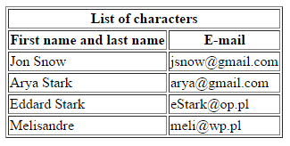
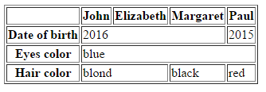

# HTML &ndash; tabele

1. Stwórz w pliku **index.html** następującą tabelę.

   

1. Stwórz w pliku **index.html** następującą tabelę.

   

## Ważne

* W pliku CSS jest przygotowany styl, dzięki czemu tabele będą miały odpowiednie obramowanie. Trzeba tylko &ndash; jak w innych zadaniach &ndash; podłączyć plik ze stylami.
* W obu tabelach pamiętaj o atrybucie **scope**.
* Nie stosuj znaczników formatujących tekst takich jak **b** czy **strong**.
* Pamiętaj nie tylko o nagłówkach poziomych, lecz także &ndash; pionowych.

## Potrzebujesz pomocy lub inspiracji?
* [colspan i rowspan](https://jsfiddle.net/barney/ZBC6d/)
* [dokumentacja, tabele](https://developer.mozilla.org/en-US/docs/Learn/CSS/Styling_boxes/Styling_tables)
* [w3.org, atrybut scope](https://www.w3.org/TR/WCAG20-TECHS/H63.html)
* HTML i CSS &ndash; pre-work

