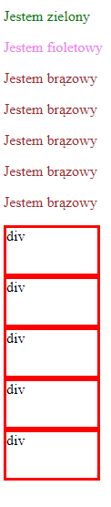

# HTML &ndash; stylowanie dokumentu

  Wykonaj poniższe polecenia. Po każdym z nich zrób następujące czynności:
  * zapisuj zmiany i odświeżaj przeglądarkę,
  * umieść komentarze z opisem, co się zmieniło i dlaczego.

Czy zaobserwowałeś jakąś zasadę CSS?

#### 1. ZEWNĘTRZNY ARKUSZ STYLI, niebieskie tło
  W katalogu **css** stwórz plik **style.css** i ustaw w nim niebieski kolor tła elementowi **body**.

#### 2. WEWNĘTRZNY ARKUSZ STYLI, różowe tło
Dodaj wewnętrzne style do sekcji **head** pliku **html**. Ustaw w nich różowy kolor tła elementowi **body**.

#### 3. STYLE INLINE, zielone tło
W pliku **html** do tagu **body** dodaj atrybut **style**. Ustaw zielony kolor tła.

---

## class i id
Celem poniższych zadań jest odpowiednie korzystanie z selektorów elementu, klasy oraz identyfikatora (id). Wykonaj poniższe polecenia, wykorzystaj wszystkie trzy typy selektorów.

1. Stwórz dwa paragrafy:
    * pierwszy o zielonym kolorze fontu,
    * drugi o czerwonym kolorze fontu.

2. Stwórz kolejne pięć paragrafów. Ustaw wszystkim brązowy kolor fontu.

3. Stwórz pięć elementów **div** o klasie **block**, mają one mieć następujące własności:
    * szerokość: 100px,
    * wysokość: 50px,
    * grubość obramowania: 3px,
    * styl obramowania: pojedyncza linia ciągła (solid),
    * kolor obramowania: czerwony.

Efekt ma być zbliżony do poniższego przykładu:

  

## Potrzebujesz pomocy lub inspiracji?
* [w3schools, selektor elementu](https://www.w3schools.com/cssref/sel_element.asp)
* [w3schools, selektor klasy](https://www.w3schools.com/cssref/sel_class.asp)
* [dokumentacja, selektor identyfikatora (id)](https://developer.mozilla.org/pl/docs/Web/CSS/ID_selectors),
* [dokumentacja, własność border](https://developer.mozilla.org/pl/docs/Web/CSS/border),
* HTML i CSS &ndash; pre-work
