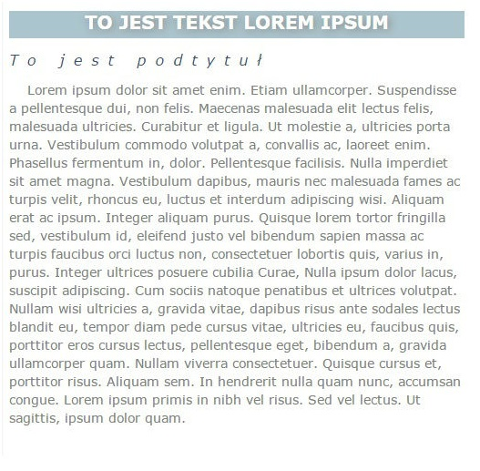

# CSS &ndash; stylowanie tekstu

## Zadanie

Stwórz element **div**, a w nim następujące elementy:

  * **h1**,
  * **h2**,
  * **p**.

Ze strony [lipsum.pl](http://lipsum.pl/) ściągnij kawałek przykładowego tekstu i wstaw go do paragrafu. Uzupełnij również tekst w nagłówkach. Następnie ostyluj element zgodnie z poniższym obrazkiem oraz specyfikacją.

## Specyfikacja
* font dla wszystkich elementów: Verdana, Arial, sans-serif;
* **div**
  * szerokość elementu: 500px;
* **h1**
	* kolor tła: #ACC4CE,
	* kolor tekstu: white,
	* wielkość fontu: 20px,
	* kolor cienia: #878787,
* **h2**
  * kolor tekstu: #395075,
  * odległość między literami: 10px,
* **p**
  * kolor tekstu: grey,
  * wielkość czcionki: 14px,
  *	wysokość linii: 20px,
  *	wcięcie: 20px.

---

## Przydatne narzędzie
[generator cienia](http://www.cssportal.com/css3-text-shadow-generator/)

## Uwaga
Postaraj się jak najlepiej odzwierciedlić przykład, zwróć uwagę na szczegóły m.in. cień w **h1** i pochylenie tekstu w **h2**. Nie wszystko jest opisane w specyfikacji powyżej.
Używaj selektorów elementów oraz klas. Nie stosuj identyfikatorów.

Style pisz w pliku **style.css**, nie stosuj styli inlinowych.

## Potrzebujesz pomocy lub inspiracji?
* [Dlaczego należy podawać więcej niż jeden font?](https://developer.mozilla.org/pl/docs/Web/CSS/font-family)
* [Jak można cieniować tekst?](https://css-tricks.com/almanac/properties/t/text-shadow/)
* [Czym jest dziedziczenie?](https://developer.mozilla.org/pl/docs/Web/CSS/Dziedziczenie)
* HTML i CSS &ndash; prework