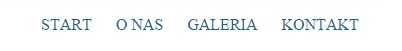

# CSS &ndash; Stylowanie list

1. Stwórz listę nieuporządkowaną zawierającą trzy elementy i zmień jej punktory na kwadraty.

2. Stwórz proste menu &ndash; oparte na liście nieuporządkowanej &ndash; według wzoru poniżej.
  Specyfikacja:   
  kolor tekstu: #116493.

## Potrzebujesz pomocy lub inspiracji?
* [dokumentacja, style listy nieuporządkowanej](https://developer.mozilla.org/pl/docs/Web/CSS/list-style-type)
* [Videtutorial, menu oparte na liście](https://www.youtube.com/watch?v=rDiiIhVuODQ)
* HTML i CSS &ndash; pre-work;
