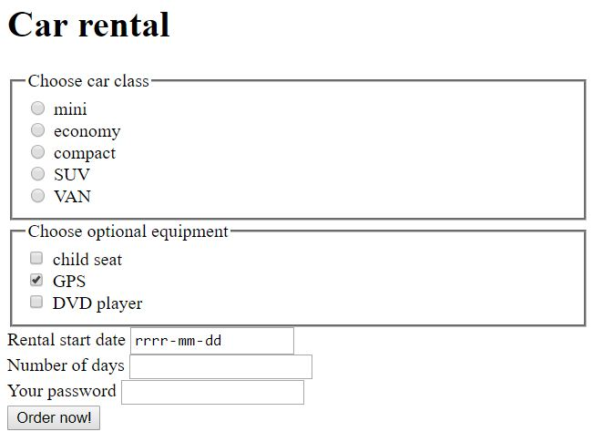

# HTML/CSS &ndash; formularze

### Wskazówki
* Wybierz najwłaściwszy w danym miejscu typ inputu. Inny jest potrzebny tam, gdzie użytkownik wpisuje adres email, inny gdy podaje datę, a inny gdy hasło itd.
* Label powinien być powiązany ze swoim inputem.
* Zauważ, że jeden z checkboksów jest domyślnie zaznaczony.
* Zajrzyj do dokumentacji, w inputach **radio** i **checkbox** szczególnie zwróć uwagę na atrybuty **name**.
* Co to za ramki widoczne w formularzu 2? Odpowiedź przynosi element **fieldset**.
* Nie zwracaj uwagi na styl formularza. Skoncentruj się na tym, aby dobrze napisać kod html. 

1. Stwórz formularz kontaktowy taki jak w poniższym przykładzie:

  
  
2. Stwórz formularz wypożyczalni samochodów według przykładu poniżej:
  
  

## Potrzebujesz pomocy lub inspiracji?
* [Labele i inputy](https://developer.mozilla.org/en-US/docs/Web/HTML/Element/label)
* [Dokumentacja, ogólnie o formularzach](https://developer.mozilla.org/en-US/docs/Web/HTML/Element/form)
* [Dokumentacjach, checkbox](https://developer.mozilla.org/en-US/docs/Web/HTML/Element/input/checkbox)
* [Dokumentacja, radio](https://developer.mozilla.org/en-US/docs/Web/HTML/Element/input/radio)
* [Czym jest fieldset?](https://developer.mozilla.org/en-US/docs/Web/HTML/Element/label)
* HTML i CSS &ndash; prework;
